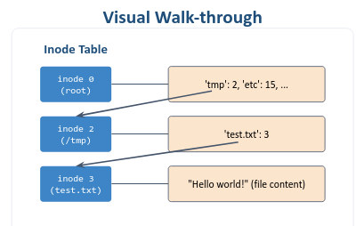
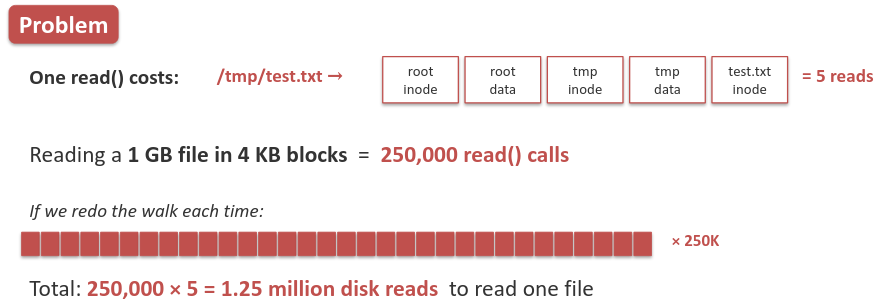
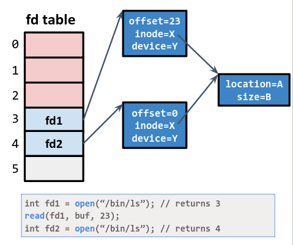
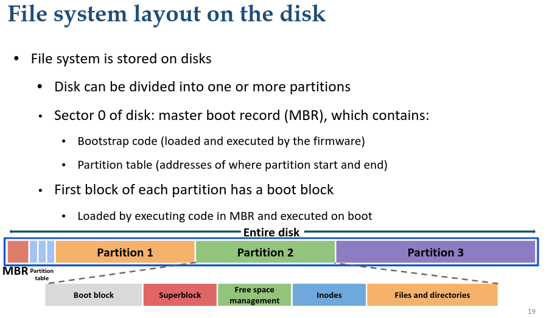
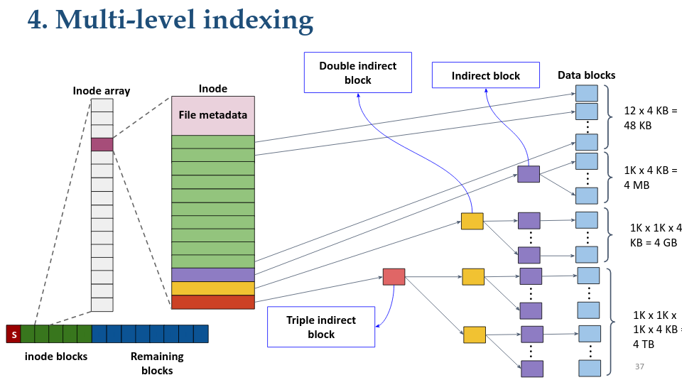
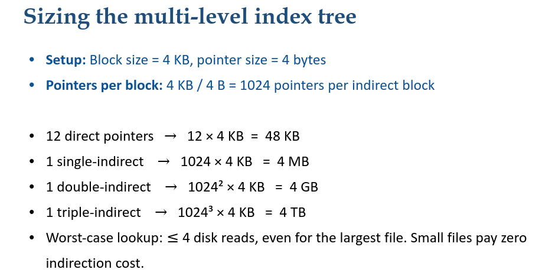

# Computer Systems

## Prise de notes lecture 11: File Systems

Outline:
File system abstractions: inodes, directories, file descriptors
File system from abstraction to implementation
- File reading and writing
- File block allocation
Importance of block cache

Importance of persistence
In computer science, persistence refers to charactheristics of state that outlives the process that created it
Example: code in vs code, close it, the os will clean up the process but tomorrow, vs code will remain in the memory

The importance of persistence
Without this capability, state would only exist in DRAM, and would be lost when the RAM loses power, such as during a computer shutdown

Purpose of a file system
Given persistent blocks {files or directories} -> give users four key capaibilties:
- Name
- Organize
- Share
- Protect

Metadata of a file:
- number, size, owner, permissions, access/modifie time

Metadata of a inode
- {metadata of a file}, block ptrs

Key points:
- Directory is a special file (stored as regular file)
- - Marked with a special flag to distinguish from regular files
- - Flag restricts API to processses (e.g., cannot write to a directory)
- - Contains array of {filename, inode} pairs

How to access the '/tmp/test.txt' file ?
1. look up 'tmp' in root directory. Find inode 2.
2. look up 'test.txt' in inode 2. Find inode 3.
3. access data blocks of inode 3 for contents.



En d'autres mots:
La root pointe vers ses sous dossiers, donc l'inode de la root pointe vers les inodes des sous dossiers, on récupère l'inode du dossier 'tmp', puis on continue le process.

### Why we need file descriptors ?



Trop couteux, je n'ai pas compris le calcul mais voici la slide

Comment résoudre ?
Do the path walk once, at open() and cache the result in a per-process file descriptor table

Operations on a file
- Each process has its fd table
- First three 3 descriptors are fixed
- - 0 -> STDIN (standart input)
- - 1 -> STDOUT (standart output)
- - 2 -> STDERR (standard error)

```
int fd1 = open("/bin/ls"); // returns 3
read(fd1, buf, 23);
int fd2 = open("/bin/ls"); // returns 4
```
fd1 is 1 and indo is X
read updates the offset to 23 from 0
fd2 returns 4 and points to same file
The offset for fd2 is set to 0



Multiple file systems
- All systems are mapped to a common root!
- ex: '/' for Windows and '/home' for Linux
- - Any directory can be a mount point '/home' can be a separate file system

Mount: Allow multiple file systems on multiple volumes to form a single logical hierarchy

Important commands:
```mount <device> <dir>```
Exemple: ```mount /dev/cdrom /media/cdrom```

File system layout on the disk
- File system is stored on disks
- - Disk can be divided into one or more partitions

 

File system superblock:
- One logical superblock per file system
- Stores the metadata about the file system
- - Number of inodes
- - Number of data blocks
- - Where the inode table begins
- - May contain information to manage free inodes/data blocks
- Read first when mounting a file system

**File op: create a file**
1. contiguous block allocation
concaténer dans le disque tous les files: problématique quand on supprime un file par exemple
[on a vu ça en comparch en plus]

2. File creation using linked blocks
A la fin du block on stocke le pointeur du projet block ; Problème : toooooooo slow pour lire le dernier file block

3. File allocation table (FAT)
au lieu de faire ce qu'on a fait juste en haut, on sépare les links des blocks. Donc on crée une liste qui stocke les pointeurs de tous les blocks ; c'est mauvais parce que c'est random

=> Solution: 
4. Multi-level indexing : force à nous !!!! je te laisse l'honneur d'expliquer en détails ce que c'est





**File op: reading from a file**
1. open the file ```open("/cs202/w10", O_RDONLY)```
- Traverse directory tree to find inode "w10"
- Read inode, check permissions, and return a file descriptor (fd)
2. For each read()
- Read inode
- Read appropriate data block (base on offset)
- Update last access time in inode
- Update file offset in in-memory open file table
Example:
```
open("/cs202/w10"):
- read root inode
- read root data
- read cs202 inode
- read cs202 data
- read w07 inode
That's 5 reads.
First read():
- read inode (or cached)
- read data[0]
- write inode (access time)
3 ops.
Second read():
- read data[1]
- write inode (access time)
2 ops
```

**File op: Writing to a file**
1. Writing to an existing file (allocating a new block):
- Read free data block bitmap (find a free block)
- Write data block bitmap (mark it allocated)
- Read the file's inode
- Write the inode (add the new block pointer)
- Write the data block itself
2. Creating a new file adds:
- Read + write inode bitmap, write the new inode
- Read + write directory data (add {name, inode} entry)
- If the directory is full, allocate new directory blocks

```
Step 1: open(“cs202/w10”)
When the filesystem tries to open/create file "w07" in directory "cs202":
• Root inode (read()):
• Reads inode of root directory (/) to locate its directory data block
pointers.
• Root data (read()):
• Reads root directory data to find the entry for "cs202".
• cs202 inode (read()):
• Reads inode for directory "cs202" to locate its directory data blocks
and metadata.
• cs202 data (read()):
• Reads directory data for "cs202" to check if "w10" already exists. Since
we’re creating "w10", it checks to ensure it doesn’t yet exist or identifies an available
inode for use.
• inode bitmap (read() and write()):
• Checks the inode bitmap (tracks inode availability). 49
• Updates directory data of "cs202" to include the new entry "w10"
(linking it to the new inode).
• w07 inode (read() and write()):
• Reads newly allocated inode and bring it to memory.
• Writes initial metadata into the inode (ownership, permissions,
timestamps).
• cs202 inode (write()):
• Updates metadata for directory "cs202" (e.g., modification timestamp,
entry count).
At the end of this step, "w07" has been created, has an inode, and is recorded in the
directory structure.
Step 2: write() to file “w10”
Now, the filesystem writes data to the new file "w10":
• w10 inode (read()):
• Reads inode again to get its metadata and determine the location to
write data.
• data bitmap (read() and write()):
• Reads the data bitmap (tracks free/used data blocks).
• Finds a free data block for storing the file’s actual content.
• Marks the chosen data block as used by writing back to the data
bitmap.
• w10 data[0] (write()):
• Writes actual file data into the allocated data block (first data block).
• w10 inode (write()):
• Updates inode metadata of "w10" to record file size, data block
location, timestamps (modified/accessed).
```

**Summary:**

A directory is just a file
- Whole tree, all path resolution reuses one abstraction (file)

Inode tree employs asymmetry for common case
- Cater to small files faster and use indirection for large files

Avoinding IO ops is critical for performance
- Block cache can speed up to 1000
