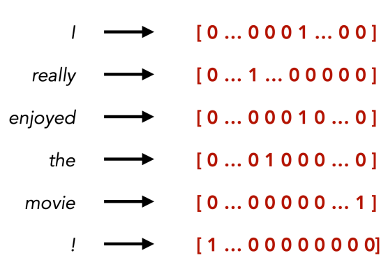
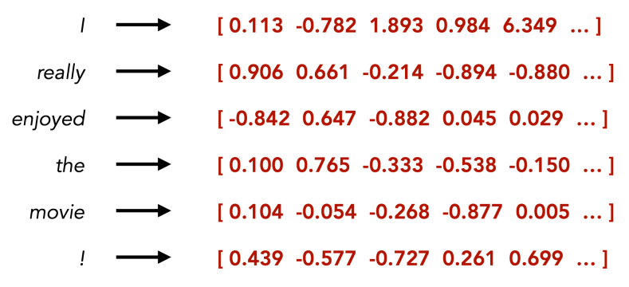
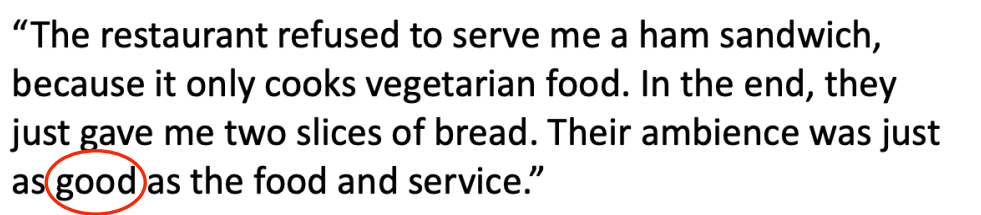
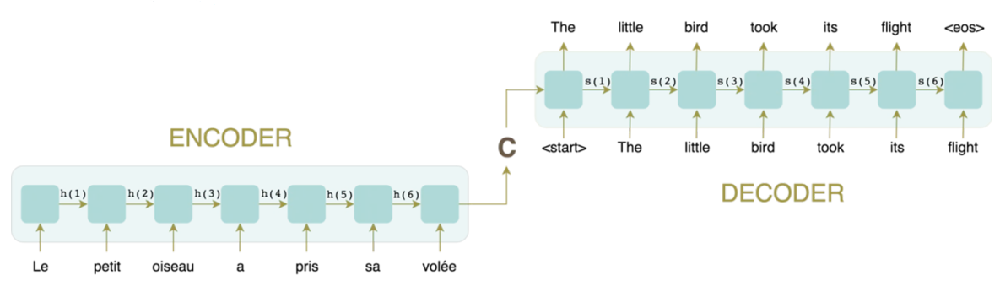
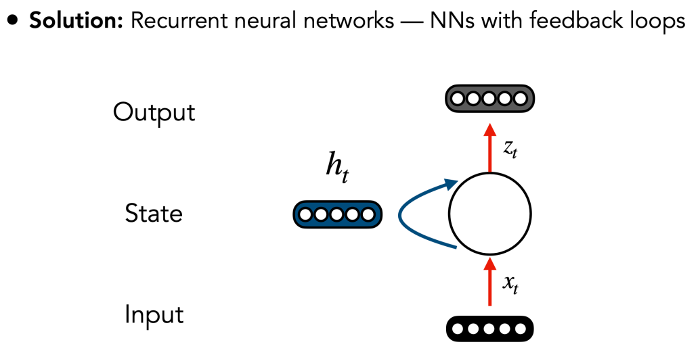
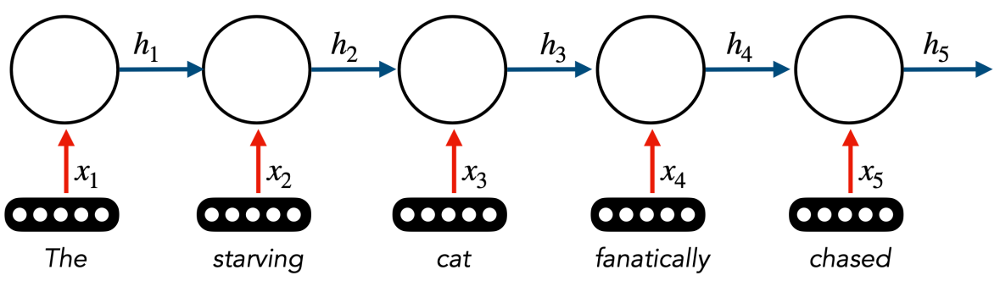
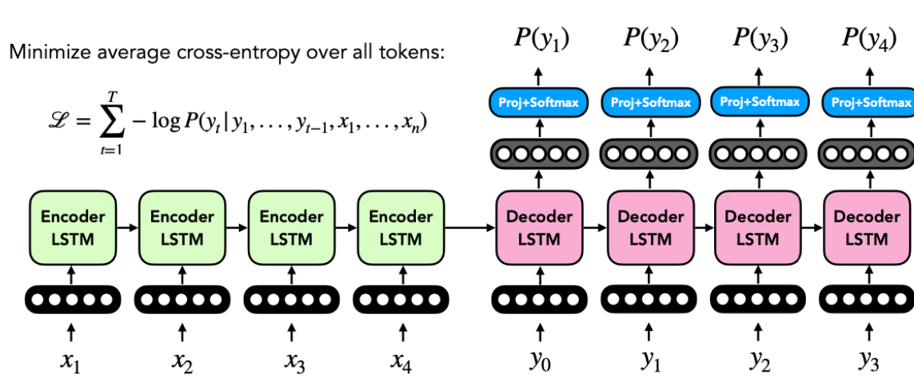

# Cours du 19/05/2026 
## Deep Learning #3 - Natural Language Processing (NLP)
*(In both supervised and unsupervised settings)*

**Goal:** Find whether a text has a positive/negative emotion

Usefull links:
- https://text-processing.com/demo/sentiment/
- https://nlp.johnsnowlabs.com/demos

A BoW encodes an entire document in an single vector.
- This is fine when the targeted ML task is at document-level
- However this won't work for word-level tasks (e.g. translation, text generation)

**In neural NLP** words are vectors

**PROBLEM:** With this representation, there is no similarity between words !

How do you learn similarity between words ?

Such that the dot product encodes the similarity between words.

### Word embeddings:
Supervised
- Optimize the embeddings for a specific task (e.g., sentiment analysis)
- Downsides: Requires supervised data, may not generalize to other tasks

Unsupervised (or self-supervised)
- “You shall know a word by the company it keeps”; J. R. Firth, 1957

**Limitations:**
- With a representation for each word, we still suffer from data heterogenity (input with different lenghts)
- Individual words are unreliable 

### Sequence to sequence models:
Instead of modeling words, the standard approach consists of modeling a complete sentence or document as a sequence

how do we model each block ?

RNN = Recurrent neural networks

We can use RNN for:
- classificationo
- sequence labeling
- generation

Different type of RNN:
- Standard RNN
- Long Short-Term Memory (LSTM)
- Gated Recurrent Unit (GRU)

Training an encoder-decoder model

- Backpropagate gradients through both the decoder and the encoder

**Limitations:**
- State represented as a single vector —> Massive compression of information
- Challenging to learn long-range dependencies/interactions